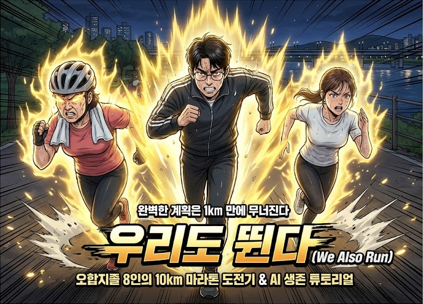

# 🏃 우리도 뛴다 (We Also Run)

> **"완벽한 계획은 1km 만에 무너진다."** 10km 마라톤 완주를 목표로 모인 8명의 오
> 합지졸 러닝 크루. 페이스 격차, 민폐 논란, 경제적 부담, 오지랖... 수많은 난관을
> 넘어 "우리도 뛸 수 있다"를 증명하는 코미디 일상 성장 드라마.

 

## 📖 읽으러 가기

웹사이트에서 소설과 실습 프롬프트를 생생하게 체험해보세요.

### 👉 [웹소설 읽으러 가기 (Click)](https://moma71.github.io/RunningCrew/)

 

---

## 🧐 작품 소개 (Synopsis)

**핵심 테마:**  
평범한 사람들의 불가능해 보이는 도전.

**줄거리:**  
IT 개발자 출신 박민수가 야심 차게 만든 러닝 크루 '우리도 뛴다'. 하지만 모인 멤버
들은 50대 아줌마, 꼰대 아저씨, 과소비녀, 운동 초보 등... 1km도 제대로 못 뛰는 오
합지졸들뿐이다. 과연 이들은 20주 후 열리는 10km 마라톤 대회를 완주할 수 있을까?

**메시지:**  
"시작은 미약했으나, 끝은 창대했다. 우리는 해냈다!"

 

## 👥 캐릭터 프로필

### 박민수 (32세, 리더)

- **직업**: IT 개발자
- **성격**: 계획형 인간(J), 완벽주의자, 소심함.
- **성장**: "계획대로 안 되면 실패"라는 강박에서 벗어나, 함께하는 즐거움을 깨닫
  는다.

### 최순옥 (52세, 엄마)

- **직업**: 주부
- **성격**: 오지랖 넓음, 정이 많음.
- **성장**: 딸에게 부끄럽지 않은 엄마가 되기 위해 도전.

### 한태수 (41세, 침묵맨)

- **직업**: 자영업 (추정)
- **성격**: 말수 적음, 묵묵히 챙겨줌.
- **Role**: 크루의 정신적 지주. Silent Observer.

### 정유미 (26세, 초보)

- **직업**: 취준생
- **성격**: 소심함, 자존감 낮음.
- **성장**: 1km도 못 뛰던 약체에서 10km 완주자로 성장.

 

## 📚 에피소드 목차 (총 20부작)

|   Phase   | Episodes | Title         | Key Theme                 |
| :-------: | :------: | :------------ | :------------------------ |
| **ACT 1** |  Ep 1-5  | **Formation** | 오합지졸들의 첫 발걸음    |
| **ACT 2** | Ep 6-10  | **Conflict**  | 우리가 계속 할 수 있을까? |
| **ACT 3** | Ep 11-15 | **Growth**    | 우리도 할 수 있다         |
| **ACT 4** | Ep 16-20 | **Climax**    | 우리는 해냈다 (완주)      |

 

## 🛠 Tech Stack

- **Core:** HTML5, CSS3, Vanilla JavaScript
- **AI Tool:** ChatGPT, Notion, Canva (used in story tutorials)
- **Hosting:** GitHub Pages

---

**We Also Run** | Based on AI Survival Webnovel Framework
